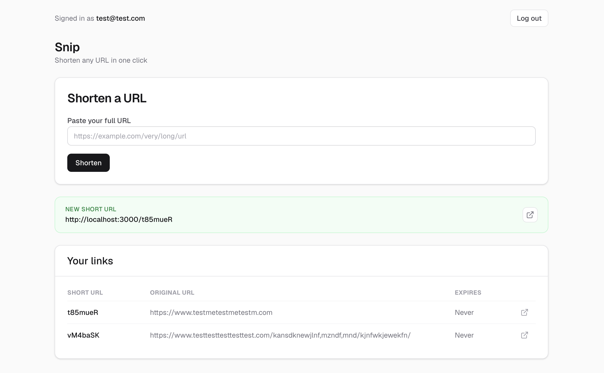

# Snip

[](https://codecov.io/gh/benbest123/url-shortener)

**[Try it live →](https://snip-iota.vercel.app)**

Sign in with the demo account — no registration needed:

| Email | Password |
|---|---|
| `demo@snip.example` | `snip-demo-2026` |

Registration is open if you'd rather make your own account. Links default to a 30-day
expiry, and creation is capped at 20 per hour per user.

A URL shortener. Paste a long link, get a short one back; visiting the short link
redirects you. Behind a login, so links are owned by whoever created them.

This is a learning project, built up in phases (see [`docs/PLAN.md`](docs/PLAN.md)) to
work through a full stack end to end — HTTP redirects, a real database with hand-written
SQL, auth, and eventually caching and analytics. The emphasis is on understanding each
piece rather than reaching for a framework that hides it.



## Stack

- **Next.js** (App Router) + **React** + **TypeScript**
- **PostgreSQL** via [`pg`](https://node-postgres.com/) — raw SQL, no ORM
- **Zod** for input validation
- **JWT** auth in an httpOnly cookie, passwords hashed with `bcryptjs`
- **Tailwind** for styling
- **Vitest** for tests
- **Vercel** (hosting) + **Neon** (serverless Postgres) in production

## Local setup

You'll need Node and a PostgreSQL server running locally.

1. **Install dependencies**

   ```bash
   npm install
   ```

2. **Create the database and load the schema**

   ```bash
   createdb url_shortener
   psql url_shortener < db/schema.sql
   ```

3. **Set environment variables** — create a `.env` file in the project root:

   ```bash
   # Postgres connection string (adjust user/host to match your setup)
   DATABASE_URL=postgres://localhost:5432/url_shortener

   # Secret used to sign JWTs — use a long random string
   JWT_SECRET=your-secret-here

   # Base URL used to build the returned short links.
   # Required — the URL routes return 500 if it's unset.
   NEXT_PUBLIC_BASE_URL=http://localhost:3000
   ```

4. **Run it**

   ```bash
   npm run dev
   ```

   Open [http://localhost:3000](http://localhost:3000), register an account, and shorten a link.

## Tests

```bash
npm test              # run once
npm run test:watch    # watch mode
npm run test:coverage # with coverage
```

The project follows red-green TDD — tests come before implementation.

## Architecture

A quick tour of how a request flows through the app:

- **Redirects** live in `app/[code]/route.ts` — a route handler (not a page), since a
  redirect is a pure HTTP response with no UI. It looks the code up in Postgres, checks
  expiry, and returns a 302.
- **The API** is a handful of route handlers under `app/api/` — auth (`register`, `login`,
  `logout`, `me`) and links (`POST`/`GET /api/urls`). Every route validates its input with
  Zod and talks to the database through the thin `query()` helper in `lib/db.ts`.
- **Auth** is a signed JWT stored in an httpOnly, sameSite cookie. `lib/auth.ts` owns
  signing, cookie handling, and the `requireUserId` guard that the protected routes use.
- **The frontend** (`app/` pages + `app/frontend/components/`) is a small React UI that
  calls the same API.

Data lives in three tables — `users`, `urls`, and `clicks` (see `db/schema.sql`). Short
codes are random 7-character strings.

Design decisions and the reasoning behind them are recorded as ADRs in
[`docs/DECISIONS.md`](docs/DECISIONS.md) — worth reading before changing the data model or
API shape.

## Roadmap

Built so far: core redirects, the Postgres data model, creating and listing links,
user auth, and **deployment** — live on Vercel with Neon Postgres, deploying
automatically on merge to `main`.

Deployment was brought forward from Phase 9 to run first
([spec](docs/superpowers/specs/2026-07-17-deploy-design.md)): nothing in the intervening
phases was a prerequisite, and shipping first means click tracking gathers real data while
caching is built — so the analytics dashboard renders real traffic rather than
self-generated clicks.

Planned, roughly in order:

- **Click tracking** — record device, referrer, and timestamp on each redirect,
  asynchronously so it doesn't slow the redirect down.
- **Caching** — Redis (Upstash) in front of Postgres for redirect lookups. Neon scales to
  zero on the free tier, so a cold redirect pays a wake-up penalty this removes.
- **Analytics dashboard** — click counts over time, by device and referrer.
- **Dockerise** — app + Postgres + Redis via Docker Compose for local development.

Full detail in [`docs/PLAN.md`](docs/PLAN.md).

## License

[MIT](LICENSE)
